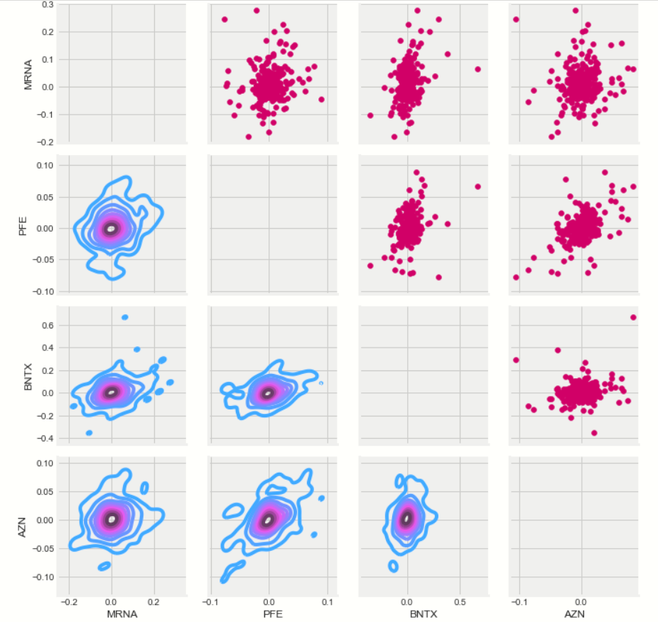
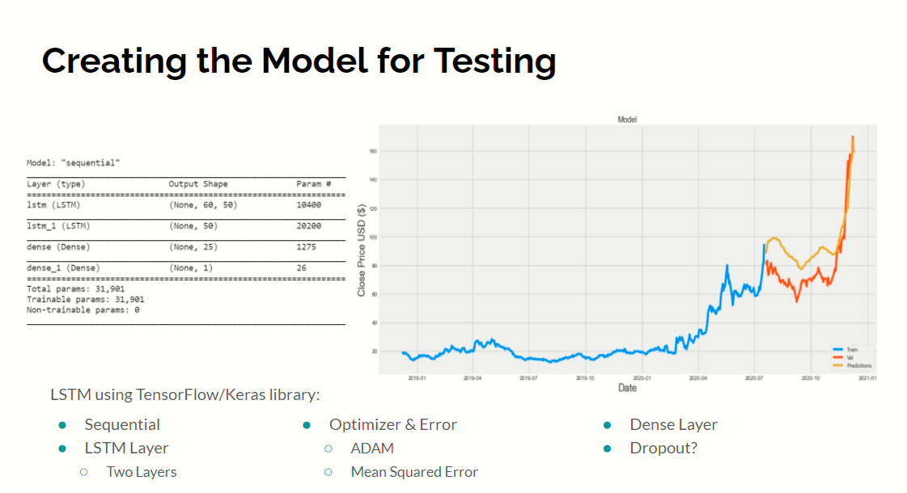
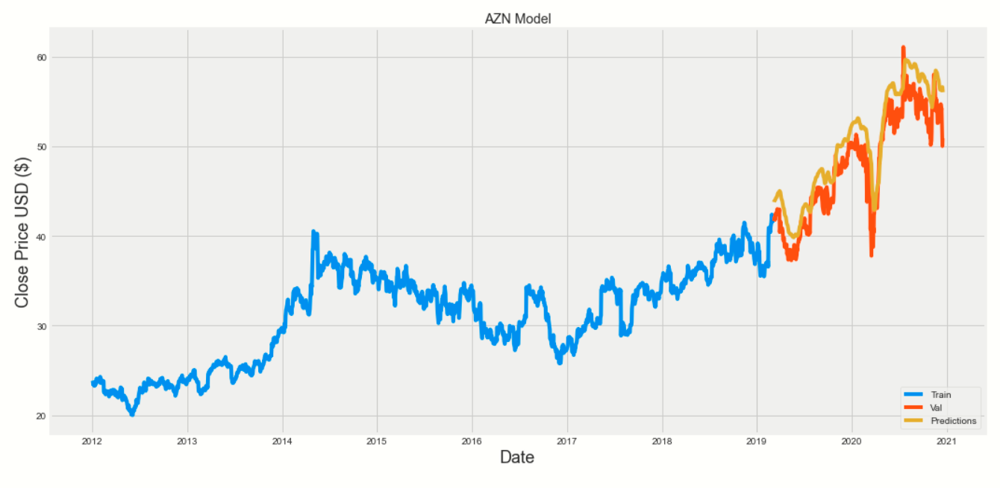

## Team 1, Project 2
# Stock Analysis and Prediction
### By: Bruno, Diana, Eve, & Peter

 

#### Introduction

In this project, we used technical analysis to review and select stocks for a machine learning algorithm to predict stock prices. It is not good enough to create predictive models for stock prices, we also need to select the correct stocks to trade. By performing our initial technical analysis, we can understand the fundamentals of the stock without emotional variables. These stocks still need to be understood within the greater context. Therefore, we perform the preliminary review with associated stocks to understand the general mood of the respective industry. This time, we decided to focus on stocks for companies involved in the creation of a Covid-19 vaccine.
 
   
#### Stock Analysis

Before we can begin reviewing the four stocks, Moderna (MRNA), Pfizer (PFE), BioNTech (BNTX), and AstraZeneca (AZN), we need to request the data we will be transforming. Using pandas_datareader API, allows us to call all stocks into their own dataframes with cohesive timeframes for transformation purposes. Our analysis centered on comparing trade volumes, standard deviation of daily returns, and moving averages for 10, 20, and 50 days. These initial manipulations of the data allowed us to visualize the stocks' relationship with the Matplotlib and Seaborn libraries. We found most value for selecting the primary training stock by reviewing the simple moving averages and by comparing the expected return with the standard deviation of the daily returns. Which ultimately led us to select Moderna MRNA. 
 
 
#### Machine Learning

Before even starting the model selection process, we reviewed several whitepapers authored by Stanford graduate students on the very same topic as our question (http://cs230.stanford.edu/projects_winter_2020/reports/32066186.pdf and http://cs229.stanford.edu/proj2013/DaiZhang-MachineLearningInStockPriceTrendForecasting.pdf). The model has had excellent results with natural language processing in part because of the natural weighting mechanisms the model systematically applies to more recent fluctuations which allows the model to identify and respond to changes in price rapidly. The decision was cemented with the relative accuracy seen from this model in the Gold prediction activity we performed in class. After selecting the model, we had to define the component layers. We attempted several combinations of Dense, LSTM, and Dropout. Surprisingly, there was little issue with overfitting and the dropout layers were adding significantly to processing times without significantly decreasing the Root Mean Squared Error (RMSE). We eventually hit upon two LSTM layers each with 50 nodes, followed by a Dense layer of 25 nodes, with a final Dense output layer of one. This model had the best blend of RMSE scores for training and testing datasets with epochs and batch sizes of one and remained efficient with resources, requiring five to ten seconds per compile.
 

 
#### Conclusion

Surprisingly, the model appears to have performed better on stocks that it was not trained upon. The RMSE for PFE was 1.9582289931860206 and AZN was 2.8795949522315856. As seen in the graphs, the model follows the actual price quite closely, although not perfectly, we are still confident that the model has not been overfit. What we are most proud of is the model's responsiveness, it follows temporary peaks and troughs quite well. Obviously, there are concerns. Since we are not completely sure of the weights the model is assigning to more recent data, we cannot explain the exact mechanics of the prediction. This concern is further exemplified with our inability to test into the future, since the model prioritizes recent changes the most, we cannot guarantee the model will not slip into a feedback loop from the most recent patterns and spiral out of control.
